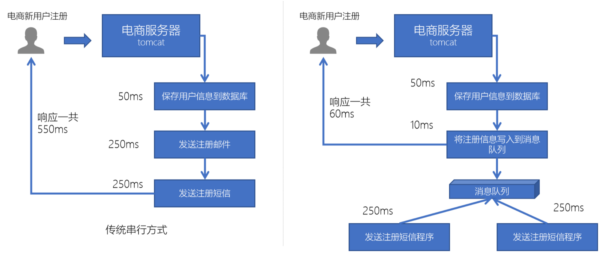
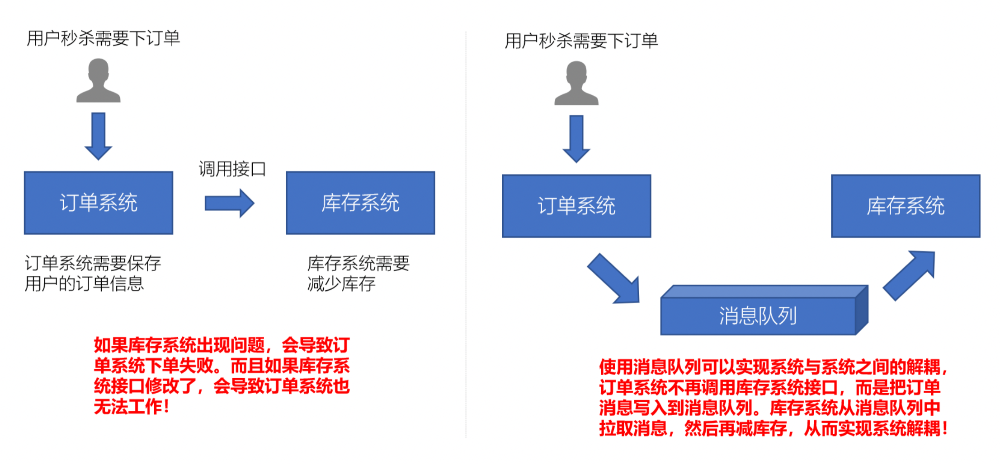
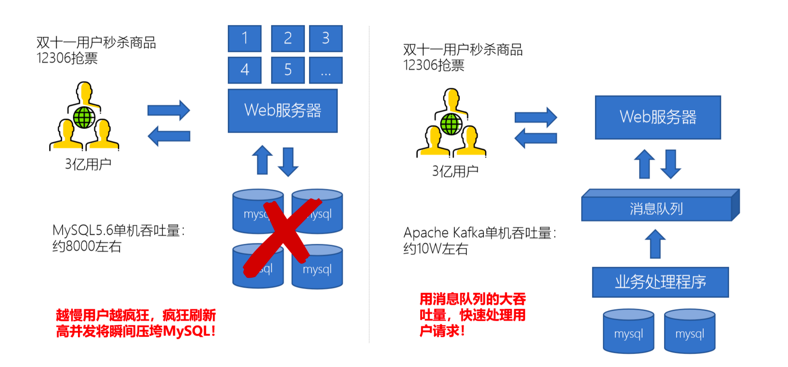
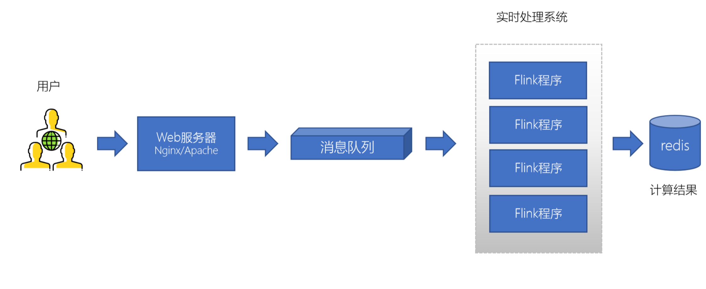

# Kafka学习笔记

## 1. Kafka简介

### 1.1 什么是Kafka

Kafka是由Apache软件基金会开发的一个开源流平台，由Scala和Java编写。Kafka的Apache官网是这样介绍Kakfa的。

Apache Kafka是一个分布式流平台。一个分布式的流平台应该包含3点关键的能力：

1. 发布和订阅流数据流，类似于消息队列或者是企业消息传递系统

2. 以容错的持久化方式存储数据流
3. 处理数据流

### 1.2 Kafka的应用场景

- 异步处理 

- 应用解耦

- 流量削峰
  - 消息队列是低延迟、高可靠、高吞吐，可应对大量并发

- 日志处理
  - 可以使用消息队列作为临时存储，或者一种通信管道 

### 1.3 消息队列的两种模型及两种模式

- 生产者、消费者模型
  - 生产者负责将消息生产到MQ
  - 消费者负责从MQ中获取消息
- 消息队列的两种模式
  - 点对点：一个消费者消费一个消息
  - 发布订阅：多个消费者可以消费一个消息

## 2. Kafka集群搭建

- kafka集群必须要有Zookeeper的
- 注意
  1. 每一个kafka的节点都需要修改broker.id
  2. log.dir数据目录必须配置