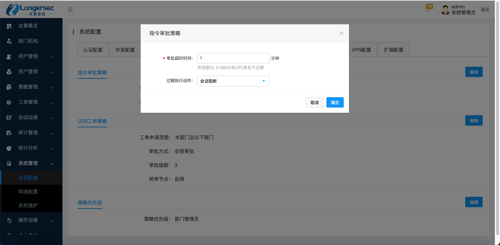
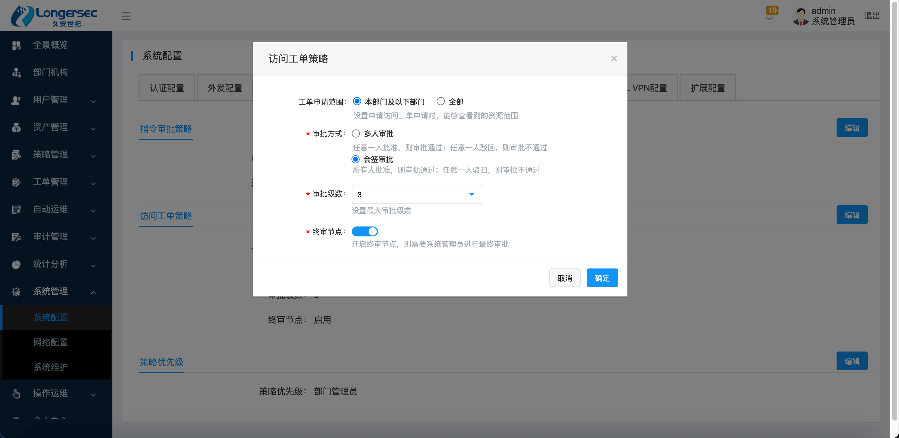

# 工单模块

## 简介

目前堡垒机工单模块主要包含指令工单、访问工单。（附加功能：数据库工单）

## 配置项说明

### 指令审批策略

| 配置项       | 描述                                                     |
| ------------ | -------------------------------------------------------- |
| 审批超时时间 | 仅对指令工单生效，且超时时间为整个工单审批的流程的时间。 |
| 过期执行动作 | 仅对指令工单生效，指令工单超时后，命令的执行动作。       |

### 访问工单策略

| 配置项       | 描述                                                   |
| ------------ | ------------------------------------------------------ |
| 工单申请范围 | 仅对访问工单生效，为创建访问工单时能够申请的设备资源。 |
| 审批方式     | 对指令工单、访问工单生效，具体看配置项说明             |
| 审批级数     | 对指令工单、访问工单生效，并在审批方式为会签审批使用。 |
| 终审节点     | 对指令工单、访问工单生效，具体看配置项说明             |

## 实现说明