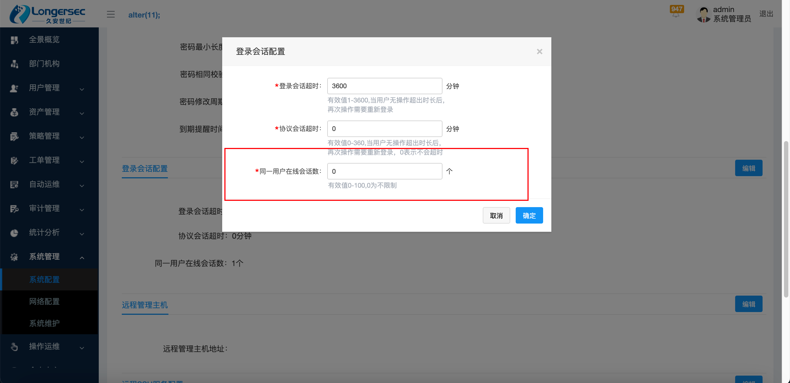
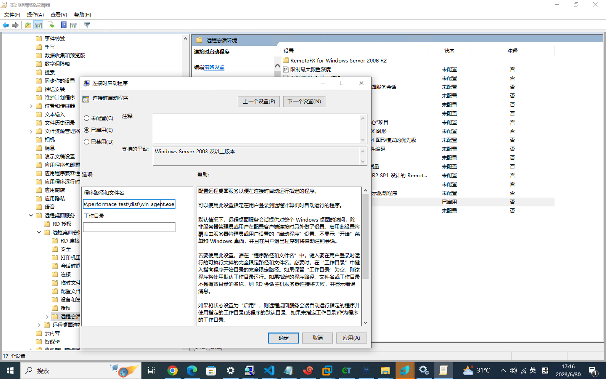

## 并发测试手册

### 字符测试

### 1. 环境准备

| 环境              | 说明                                           |
| ----------------- | ---------------------------------------------- |
| 堡垒机            |                                                |
| 3-5台运维电脑     | 具体数量可根据测试并发数决定，需要安装ui_agent |
| 10台linux目标设备 | 具体数量可由测试并发数决定                     |

### 2. 测试步骤

1. 系统管理-》系统配置-》安全配置-》登录会话配置，将同一用户在线会话数设置为0（不限制）。



2. 策略管理-》运维策略中清除所有的策略，并将字符的设备账号配置给admin。

3. 在运维电脑上传**ui_agent**，并在程序同级目录下增加配置文件**settings.toml**。

   | 配置项           | 说明                                                         |
   | ---------------- | ------------------------------------------------------------ |
   | url              | 堡垒机访问地址                                               |
   | username         | 堡垒机账号                                                   |
   | password         | 堡垒机密码                                                   |
   | task_max_workers | 任务数量，即打开n个浏览器，阈值为50，并发数：策略关联设备账号数*任务数量 |
   | headless         | 是否保持浏览器静默，1 开启 0 关闭                            |

   ```html
   url = "https://192.168.1.125"
   username = "admin"
   password = "admin@123"
   task_max_workers = 3
   headless = 1
   ```

4. 启动**ui_agent**，并在堡垒机审计管理-》实时会话查看实时在线会话，在线会话数即为并发数。

5. 观察并记录堡垒机cpu、内存使用情况。

## 图形测试

### 1. 环境准备

| 环境               | 说明                                                         |
| ------------------ | ------------------------------------------------------------ |
| 堡垒机             |                                                              |
| 3-5台运维电脑      | 具体数量可根据测试并发数决定                                 |
| 3台windows目标设备 | 需要安装win_agent，并且开启多用户访问会话，具体数量可根据测试并发数决定 |

### 2. 测试步骤

1. windows目标设备采用应用发布机配置域用户模式，并手动添加账户录入至堡垒机中。

2. windows目标设备配置rdp会话开启时启动win_agent。打开"运行"对话框，可以使用快捷键Win + R。输入"gpedit.msc"并按Enter键，打开本地组策略编辑器。导航到计算机配置-》管理模版-》Windows组件-》远程桌面服务-》远程桌面会话主机-》远程会话环境中，配置连接时启动应用程序为win_agent.exe。

   

3. 在运维电脑上传**ui_agent**，并在程序同级目录下增加配置文件**settings.toml**与字符会话配置一致。

4. 启动**ui_agent**，并在堡垒机审计管理-》实时会话查看实时在线会话，在线会话数即为并发数。

5. 观察并记录堡垒机cpu、内存使用情况。