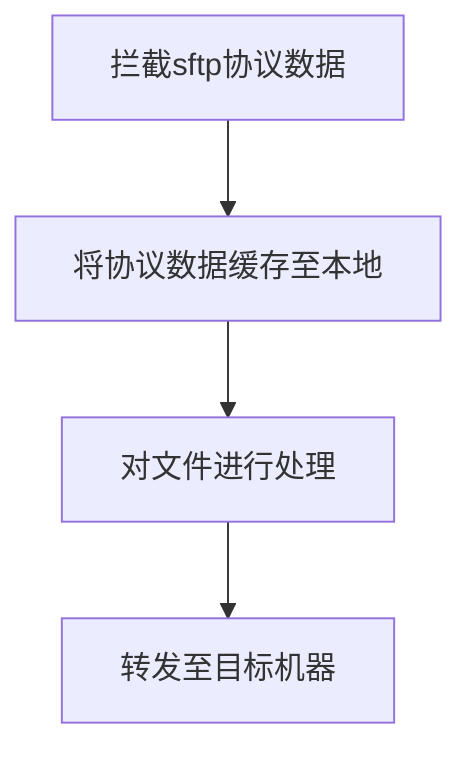

#### 技术交底书

#### 发明名称

基于sftp协议代理的文件杀毒传输的方法、装置

#### 技术背景

SFTP是文件传输协议(FTP)的安全版本，也是SSH协议的一部分，可通过安全SHELL(SSH)数据流轻松进行数据传输和数据访问。它提供了一个安全的连接来传输文件，并在本地和远程系统上遍历文件系统。通过SFTP传输的数据为加密数据，但对文件自身的安全无法保障。

我们可以通过做一层代理来解决文件传输过程中，文件本身的安全问题。通过对协议数据的拦截，我们可以得到文件副本，可对副本进行处理后转发至目标机器。

#### 相似专利

一种SFTP数据采集及审计的方法及系统（CN106941476B）

#### 技术方案

1. 本发明专利的总体流程图如下



2. 时序图

```markdown
                                                                                                                                                                                                                                                                                                                                                                                                                                                                    
          ┌───────────────┐                ┌───────────────┐                 ┌───────────────┐
          │               │                │               │                 │               │
          │    client     │                │     proxy     │                 │    target     │
          │               │                │               │                 │               │
          └───────────────┘                └───────────────┘                 └───────────────┘
                  │                                │                                 │        
                                                                                              
                  ├────────────────────────────────┤                                 │        
                  │              auth              │                                          
                  ┼                                ▼                                 │        
                 ┌─┐                              ┌─┐                                         
                 │ │                              │ │                                │        
                 │ │                              │ │                                         
                 │ │                              │ │                                │        
                 │ │                              │ │                                         
                 │ │                              │ │                                │        
                 │ │                              └─┘                                         
                 │ │                               │                                 │        
                 │ │                                                                          
                 │ │                               │                                 │        
                 │ │                                           connect                        
                 │ │                               │                                 │        
                 │ │                               ┌─────────────────────────────────┐        
                 │ │                               │                                 │        
                 │ │                               │                                 ▼        
                 │ │                              ┌┴┐                               ┌┴┐       
                 │ │                              │ │                               │ │       
                 │ │                              │ │                               │ │       
                 │ │                              │ │                               │ │       
                 └┬┘                              │ │                               │ │       
                  ▲                               │ │                               │ │       
                  │                               └┬┘                               └┬┘       
                                                   │                                 │        
                  │           connect              │             connect             │        
                   ─ ─ ─ ─ ─ ─success─ ─ ─ ─ ─ ─ ─ ┴ ─ ─ ─ ─ ─ ─ success ─ ─ ─ ─ ─ ─ ┘        
                  │                                │                                 │        
                                                                                              
                  │             intercept          │                                 │        
                              SSH_FXP_WRITE                                                   
                  ├───────────,SSH_FXP_READ────────┤                                 │        
                  │             packets.           │                                          
                  │           handle file.         ▼                                 │        
                 ┌─┐                              ┌─┐                                         
                 │ │                              │ │                                │        
                 │ │                              │ │                                         
                 │ │                              │ │                                │        
                 │ │                              │ │                                         
                 │ │                              │ │                                │        
                 └─┘                              └─┘                                         
                  │                                │           File                  │        
                                                   └────────forwarding───────────────┐        
                  │                                │                                 ▼        
                                                                                    ┌─┐       
                  │                                │                                │ │       
                                                                                    │ │       
                  │                                │                                │ │       
                                                                                    │ │       
                  │                                │                                │ │       
                                                                                    └─┘       
                  │                                │                                 │        
                                                                                                  
                                                                                              
```


2. 算法流程

- 代理端(proxy)与客户端(client)建立sftp连接，完成认证阶段。从客户端(client)数据中拿到需要连接的目标机器(target)的信息，与目标机器建立连接。
- 提取SFTP数据的关键操作码，从代理端拦截sftp的SSH_FXP_OPEN、SSH_FXP_CLOSE、SSH_FXP_WRITE、SSH_FXP_READ的数据，并通过认证阶段生成的加密算法，解析拿到的数据。
- OPEN拿到文件的基本信息，然后从WRITE或者READ中拿到文件的数据，将文件写入本地，并通过CLOSE确认文件写入完成。
- 在本地对缓存文件进行扫描，并对文件的信息进行记录
- 文件处理完成后，将本地文件通过sftp模拟SSH_FXP_OPEN、SSH_FXP_CLOSE、SSH_FXP_WRITE、SSH_FXP_READ数据发送至目标机器（target)

#### **发明的关键点和发明点**

1. 对sftp协议进行加固，对文件也进行了安全防护。
2. 可扩展性，通过代理sftp协议数据，可对操作进行管控。

