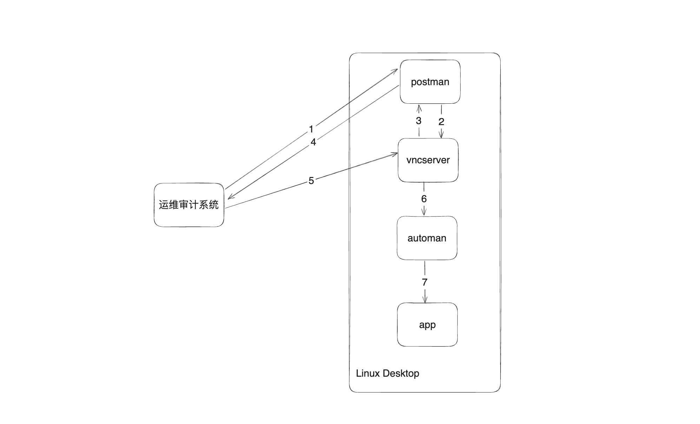

# 一种应用于运维审计系统Linux应用发布的实现

## 背景

堡垒机应用发布本质上时为了审计运维用户操作应用（包括BS应用与CS应用）。堡垒机通过与应用发布机进行交互来监控运维人员的操作，并对运维人员的鼠标与键盘记录进行审计。目前市面上主流的是使用Windows作为应用发布服务器（Windows本身就提供remote app这种功能），使用Linux设备作为应用发布机的偏少。本专利主要应用于运维审计系统，可对Linux上的应用进行发布与使用。

## 相似专利

CN201410835575.5 一种web应用发布方法、应用发布服务器和web服务器

## 技术点

1. 大体框架

   

2. 服务介绍
   - 运维审计系统(堡垒机)：用户通过浏览器访问运维审计系统，可在运维审计系统上通过vnc代理的方式对应用进行访问。
   - postman：桌面常驻服务程序，与运维升级系统进行加密通讯，负责新建vncserver会话。
   - vncserver：提供远程桌面，运维审计系统通过vnc协议进行连接并使用应用。
   - automan：代填程序，通过hook vncserver的连接启动对应的应用程序并将对应的参数代填。
   - app：具体的应用程序，包括B/S应用与C/S应用。

3. 步骤详解

   1）运维审计系统发送rpc请求至postman（桌面常驻服务程序），postman首先会通过证书验证请求的合法性。

   2）若请求合法，则会从端口池中选择任意一个端口建立vncserver服务

   3，4）最后postman会将vncserver的端口与随机密码返回至运维审计系统。

   5）运维审计系统会通过vnc协议连接至vncserver，这部分校验由vncserver进行控制。

   6）automan会hook vncserver的连接，若连接成功后会自动调用atuoman程序，automan可以通过连接的密码解析出需要代填的参数与程序。

   7）automan通过 *AT-SPI*技术与应用程序进行通讯，并将对应的参数在指定位置中填入。