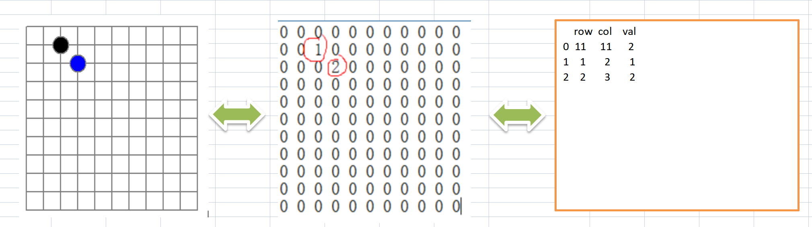
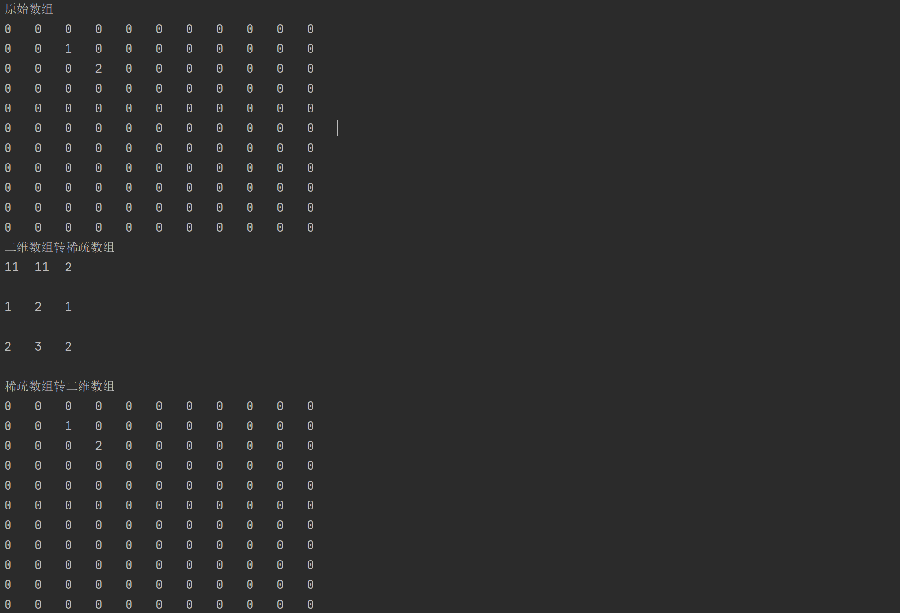
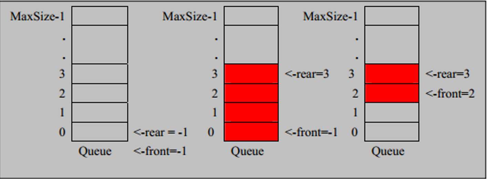
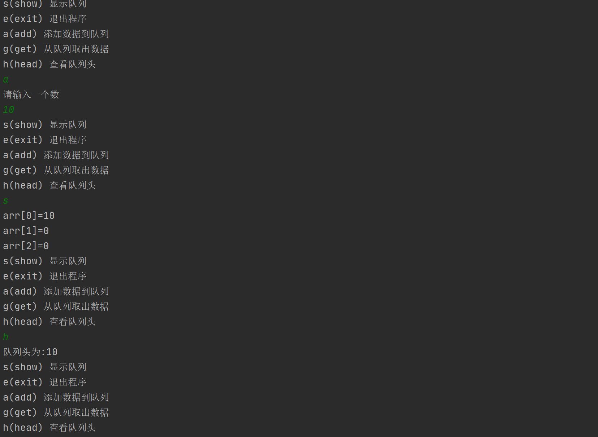
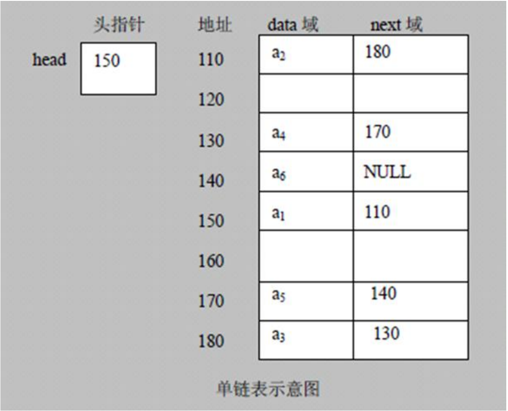
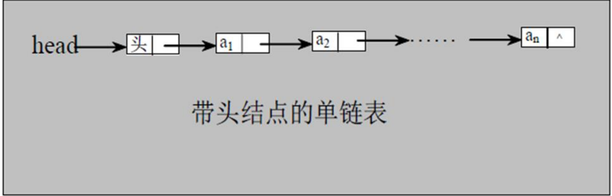

::: tip
数据结构
:::

## 数据结构---尚硅谷

###   1.  简介

数据结构分为`线性结构`与`非线性结构`。

- 线性结构
  1. 线性结构作为常见的数据结构，其特点就是`数据元素之间有一对一的线性关系`。
  2. 线性结构有两种不同的存储结构，分别为`顺序存储结构`链式存储结构`。
  3. 顺序存储的线性表称为顺序表，顺序表中的的存储元素是连续的。
  4. 链式存储的线性表称为链表，链表存储的元素不一定是连续的，元素节点中存放数据元素以及其相连元素的信息。
  5. 线性结构常见的有：`数组`、`链表`、`队列`、`栈`。
- 非线性结构
  1. 非线性结构包括的有：二维数组、多维数组、广义表、树结构、图结构。


###   2.  稀疏数组

##### 概念

 稀疏数组可以看成是普通数组压缩过后的数组，当一个数组中大部分的值为0时或者为同一值时，可以使用稀疏数组来保存。

##### 图解

左边为棋盘。

中间用0标识未下过的棋，1标识黑子，2标识蓝子。

右边为构建稀疏数组。



 ##### 代码实现

二维数组转稀疏数组
1. 首先先遍历原始二维数组得到有效数据sum。
2. 根据有效数据就可以创建稀疏数组sparseAr\[3\][sum+1]
3. 将二维数组的数据存入稀疏数组。

稀疏数组转二维数组

1. 首先先读取稀疏数组的第一行数据，根据数据创建出原始的二维数组。

2. 再读取稀疏数组剩下的数据，赋值给原始的二维数组。

```java
public class SparseArray {

    public static void main(String[] args) {
        // 创建一个原始的二维数组 11 * 11
        // 0: 表示没有棋子， 1 表示 黑子 2 表蓝子
        int[][] originArray = new int[11][11];
        originArray[1][2] = 1;
        originArray[2][3] = 2;

        System.out.println("原始数组");
        for (int i = 0; i < originArray.length; i++) {
            for (int j = 0; j < originArray[i].length; j++) {
                System.out.print(originArray[i][j] + "\t");
            }
            System.out.println();
        }

        System.out.println("二维数组转稀疏数组");
        // 得到有效个数
        int total = 0;
        for (int i = 0; i < originArray.length; i++) {
            for (int j = 0; j < originArray[i].length; j++) {
                if (originArray[i][j] != 0){
                    total++;
                }
            }
        }
        // 创建稀疏数组
        int[][] sparseArr = new int[total+1][3];
        sparseArr[0][0] = 11;
        sparseArr[0][1] = 11;
        sparseArr[0][2] = total;
        int sum = 0;
        for (int i = 0; i < originArray.length; i++) {
            for (int j = 0; j < originArray[i].length; j++) {
                if (originArray[i][j] != 0){
                    sum++;
                    sparseArr[sum][0] = i;
                    sparseArr[sum][1] = j;
                    sparseArr[sum][2] = originArray[i][j];
                }
            }
        }
        // 遍历查看稀疏数组
        for (int i = 0; i < sparseArr.length; i++) {
            System.out.println(sparseArr[i][0] + "\t" + sparseArr[i][1] + "\t" + sparseArr[i][2] + "\n");
        }


        // 稀疏数组-> 二维数组
        System.out.println("稀疏数组转二维数组");
        // 根据稀疏数组的第一行的值创建二维数组
        int[][] tooriginArr = new int[sparseArr[0][0]][sparseArr[0][1]];
        // 从1开始遍历稀疏数组将值赋值给二维数组
        for (int i = 1; i < sparseArr.length; i++) {
            tooriginArr[sparseArr[i][0]][sparseArr[i][1]] = sparseArr[i][2];
        }
        for (int i = 0; i < tooriginArr.length; i++) {
            for (int j = 0; j < tooriginArr[i].length; j++) {
                System.out.print(tooriginArr[i][j] + "\t");
            }
            System.out.println();
        }

    }

}
```




###   3.  队列

##### 概念

队列是一个有序列表，可以用数组和链表来实现。遵循`先进先出`的选择，即先存入队列的数据，要先取出，后存入的要后取。

##### 图解

队列本身是有序列表，如果使用数组来实现MaxSize为该队列最大长度，`-front与-rear分别标识该队列的前端和后端的下标`。

-front与-rear为相同值时，说明该队列无数据。



##### 代码实现

数组模拟队列实现

1. 当往队列中添加数据时，rear（尾指针）往后移 rear+1，当rear = front ，代表队列为空
2. 若尾指针 rear 小于队列的最大下标 maxSize-1，则将数据存入 rear所指的数组元素中，否则无法存入数据。 rear  == maxSize - 1[队列满]。

```java
public class QueueArrayDemo {

    public static void main(String[] args) {
        // 创建一个队列
        QueueArray queueArray = new QueueArray(3);
        char key = ' '; // 接收用户输入
        Scanner scanner = new Scanner(System.in);
        boolean loop = true;
        // 输出一个菜单
        while (loop){
            System.out.println("s(show) 显示队列");
            System.out.println("e(exit) 退出程序");
            System.out.println("a(add) 添加数据到队列");
            System.out.println("g(get) 从队列取出数据");
            System.out.println("h(head) 查看队列头");
            key = scanner.next().charAt(0);
            switch (key){
                case 's':
                    queueArray.showQueue();
                    break;
                case 'e':
                    scanner.close();
                    loop = false;
                case 'a':
                    System.out.println("请输入一个数");
                    int i = scanner.nextInt();
                    queueArray.addQueue(i);
                    break;
                case 'g':
                    try {
                        int queue = queueArray.getQueue();
                        System.out.println("取出的数据为："+ queue);
                    }catch (Exception e){
                        System.out.println(e.getMessage());
                    }
                    break;
                case 'h':
                    try {
                        int i1 = queueArray.headQueue();
                        System.out.println("队列头为:" + i1);
                    }catch (Exception e){
                        System.out.println(e.getMessage());
                    }
                    break;
                default:
                    break;
            }
        }
        System.out.println("程序退出");

    }
}

class QueueArray{

    /**
     * 队列最大值
     */
    private int maxSize;

    /**
     * 队列头标
     */
    private int front;

    /**
     * 队列尾标
     */
    private int rear;

    /**
     * 数据存储
     */
    private int[] queueArr;

    /**
     * 构造方法
     * @param max
     */
    public QueueArray(int max){
        this.maxSize = max;
        queueArr = new int[max];
        front = -1;
        rear = -1;
    }

    /**
     * 判断队列是否已满
     * @return
     */
    public boolean isFull(){
        return rear == maxSize - 1;
    }

    /**
     * 判断队列是否为空
     */
    public boolean isEmpty(){
        return rear == front;
    }

    /**
     * 队列中添加数据
     * @param n
     */
    public void addQueue(int n){
        if (isFull()){
            System.out.println("该队列已经满了");
            return;
        }
        // 尾标先加1，将数据存放到数组中
        queueArr[++rear] = n;
    }

    /**
     * 获取队列的数据，出队列
     */
    public int getQueue(){
        if(isEmpty()){
            System.out.println("该队列为空");
            throw new RuntimeException("数据为空");
        }
        if (isFull()){
            System.out.println("队列满了");
            throw new RuntimeException("队列满了");
        }
        return queueArr[++front];
    }

    /**
     * 显示队列所有数据
     */
    public void showQueue(){
        if(isEmpty()){
            System.out.println("该队列为空");
            return;
        }
        for (int i = 0; i < queueArr.length; i++) {
            System.out.printf("arr[%d]=%d\n",i,queueArr[i]);
        }
    }

    /**
     * 显示队列的头数据
     * @return
     */
    public int headQueue(){
        if (isEmpty()){
            System.out.println("该队列为空");
            throw new RuntimeException("数据为空");
        }
        return queueArr[front + 1];

    }
    
}
```



数组模拟环形队列的思路分析


###   4.  链表

##### 概念

链表是有序列表，它是以节点方式存储的，是链式存储。链表的各个节点不一定是连续存储的。

##### 图解

链表在内存中存储



逻辑结构示意图



##### 代码实现

###   5.  栈

##### 概念

1. 栈（stack）是一个先入后出（FILO）的有序列表。

2. 栈是限制线性表中元素的插入和删除只能在线性表的同一端进行的一种特殊线性表。允许插入删除的一段，为变化的一段称为栈顶。

   另一端为固定的一端，称为栈底。

3. 

##### 图解


