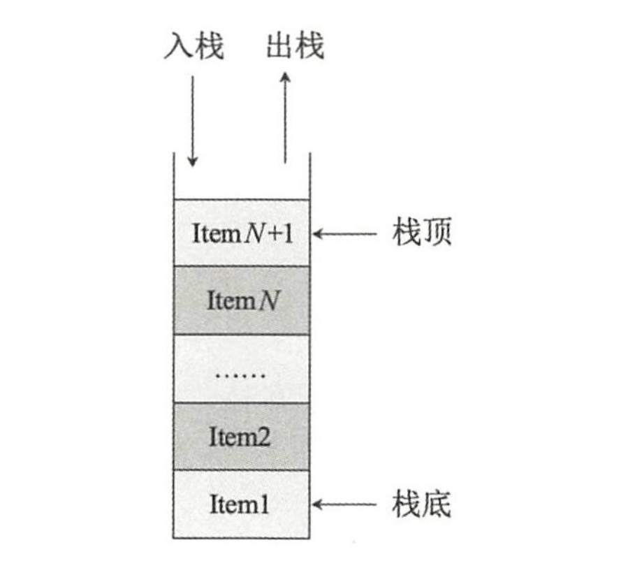

::: tip
数据结构
:::

## 数据结构---offer来了

###   1.  常用数据结构介绍

| 数据结构 | 优点                 | 缺点                             |
| -------- | -------------------- | -------------------------------- |
| 栈       | 顶部元素插入和取出快 | 除顶部元素外，存取其它元素都很慢 |
| 队列     |                      |                                  |
|          |                      |                                  |
|          |                      |                                  |
|          |                      |                                  |
|          |                      |                                  |
|          |                      |                                  |

###   2.  栈及其java代码实现

##### 概念

栈（Stack）又名堆栈，是允许在同一端进行插入和删除的特殊线性表。其中允许插入和删除的操作的一端叫作栈顶（Top）,另一端叫作栈底（Bottom）,栈底固定，栈顶浮动。插入一般叫作进栈（Push），删除叫作退栈（Pop）。栈（FILO-First）的特点是先入先出。

##### 图解

##### 代码实现

