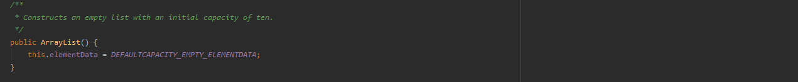
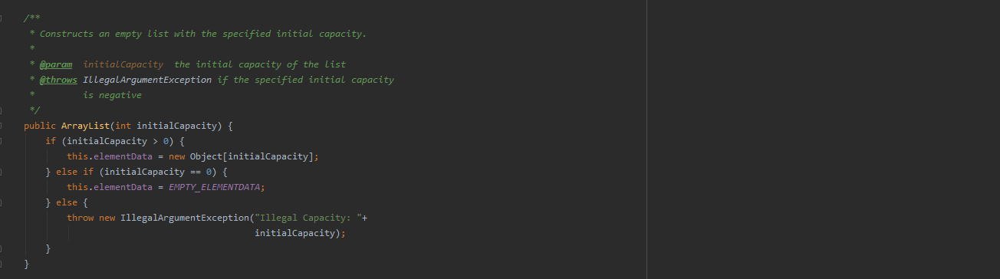
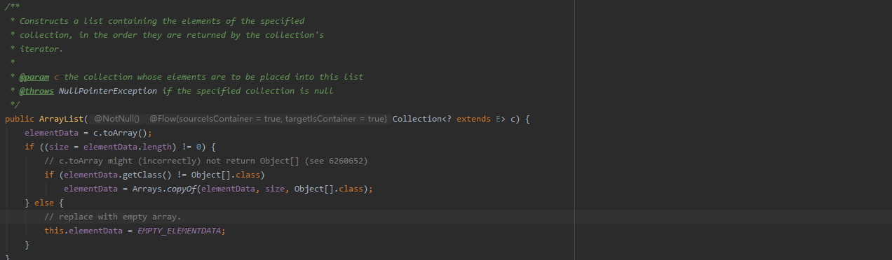

::: tip 介绍
ArrayList集合底层原理
:::

## ArrayList集合

###   1.  介绍

ArrayList是有序集合，其底层是基于`数组`实现的，数组元素的类型为Object类型，对ArrayList的所有操作底层都是基于数组的。

### 2. 线程安全性

ArrayList集合是`线程不安全`的。ArrayList添加元素是分两部分完成，第一步先在elementData[size] 上赋值，然后再将size增加1。由于这个在多线程下无法保证具有原子性，因此ArrayList在多线程下是不安全的。

###  3. 主要成员变量

DEFAULT_CAPACITY： 默认容量 为`10`。

EMPTY_ELEMENTDATA：指定容量大小为0时默认的空对象数组。

DEFAULTCAPACITY_EMPTY_ELEMENTDATA：无参构造默认的空对象数组。

elementData：存储数据的数组。

size：集合存放的数据个数，默认为0。

MAX_ARRAY_SIZE：集合存放的最大值，为`Integer.MAX_VALUE - 8`。

```java
    /**
     * 当ArrayList的构造方法中没有显示指出ArrayList的数组长度时，类内部使用默认缺省时对象数组的容量大小，为10。
     */
    private static final int DEFAULT_CAPACITY = 10;

    /**
     * 当ArrayList的构造方法中显示指出ArrayList的数组长度为0时，类内部将EMPTY_ELEMENTDATA 这个空对象数组赋给elemetData数组。
     */
    private static final Object[] EMPTY_ELEMENTDATA = {};

    /**
     * 当ArrayList的构造方法中没有显示指出ArrayList的数组长度时，类内部使用默认缺省时对象数组
     */
    private static final Object[] DEFAULTCAPACITY_EMPTY_ELEMENTDATA = {};

    /**
     * ArrayList的底层数据结构，只是一个对象数组，用于存放实际元素，并且被标记为transient，也就意味着在序列化的时候此字段是不会被序列化的。
     */
    transient Object[] elementData;

    /**
     * ArrayList中存放的元素的个数，默认时为0个元素。
     */
    private int size;

    /**
     * ArrayList中的对象数组的最大数组容量为Integer.MAX_VALUE – 8。
     */
    private static final int MAX_ARRAY_SIZE = Integer.MAX_VALUE - 8;
```

###  4. 构造方法

- 无参构造

  对于无参构造方法，将成员变量elementData的值设为DEFAULTCAPACITY_EMPTY_ELEMENTDATA。

  

  ```
  public ArrayList() {
  		// 无参构造 elementData赋值为空数组
          this.elementData = DEFAULTCAPACITY_EMPTY_ELEMENTDATA;
  }
  ```

  

- int类型构造

  如果initialCapacity大于0，则创建一个大小为initialCapacity的对象数组赋给elementData。

  如果initialCapacity等于0，则将EMPTY_ELEMENTDATA赋给elementData。

  如果initialCapacity小于0，抛出异常（非法的容量）。

  

  ```
  public ArrayList(int initialCapacity) {
          if (initialCapacity > 0) {
          	// 初始化大小大于0 elementData赋值一个initialCapacity大小的数组
              this.elementData = new Object[initialCapacity];
          } else if (initialCapacity == 0) {
          	// 初始化大小为0 elementData赋值空数组
              this.elementData = EMPTY_ELEMENTDATA;
          } else {
              // 初始容量小于0，抛出异常
              throw new IllegalArgumentException("Illegal Capacity: "+
                                                 initialCapacity);
          }
  }
  ```

  

- Collection<? extends E>类型构造

  

  ```java
  public ArrayList(Collection<? extends E> c) {
      	 // 转化为数组
          elementData = c.toArray();
          // 
          if ((size = elementData.length) != 0) {
              // 是否成功转化为Object类型数组
              if (elementData.getClass() != Object[].class)
                  // 不为Object数组的话就进行复制
                  elementData = Arrays.copyOf(elementData, size, Object[].class);
          } else {
              // 传入大小为0 时赋值空数组
              this.elementData = EMPTY_ELEMENTDATA;
          }
  }
  ```

  ### 5. 扩容机制

  ```java
  // add方法
  public boolean add(E e) {
      // 调用ensureCapacityInternal方法扩容
      ensureCapacityInternal(size + 1);  // Increments modCount!!
      // 将元素添加到数组中，然后将size（长度）+1
      elementData[size++] = e;
      return true;
  }
  
  private void ensureCapacityInternal(int minCapacity) {
  	 // 首先调用calculateCapacity方法得到最小容量，然后在调用ensureExplicitCapacity方法进行扩容
       ensureExplicitCapacity(calculateCapacity(elementData, minCapacity));
  }
  
  // 如果原数组为空，则默认扩容到10
  private static int calculateCapacity(Object[] elementData, int minCapacity) {
      if (elementData == DEFAULTCAPACITY_EMPTY_ELEMENTDATA) {
          return Math.max(DEFAULT_CAPACITY, minCapacity);
      }
      return minCapacity;
  }
  
  private void ensureExplicitCapacity(int minCapacity) {
      modCount++;
  
      // 判断当前是否需要扩容
      if (minCapacity - elementData.length > 0)
          grow(minCapacity);
  }
  
  private void grow(int minCapacity) {
      // overflow-conscious code
      // 原容量
      int oldCapacity = elementData.length;
      // 扩容1.5倍
      int newCapacity = oldCapacity + (oldCapacity >> 1);
      // 默认数组为空时给10（DEFAULT_CAPACITY）
      if (newCapacity - minCapacity < 0)
          newCapacity = minCapacity;
      if (newCapacity - MAX_ARRAY_SIZE > 0)
          newCapacity = hugeCapacity(minCapacity);
      // minCapacity is usually close to size, so this is a win:
      // copy原始的元素到新数组中，数组扩容到newCapacity
      elementData = Arrays.copyOf(elementData, newCapacity);
  }
  ```
