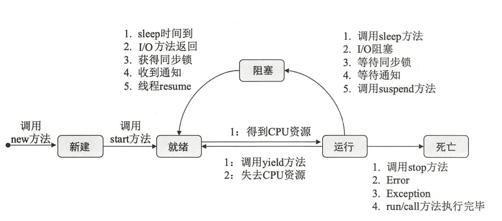

::: tip 介绍
JAVA 学习笔记
:::

#### 线程的生命周期

线程的生命周期分为`新建（NEW）`、`就绪（Runnable`）、`运行（Running）`、`阻塞（Blocked）`、`死亡（Dead）`。

调用流程

1. 调用new方法新建一个线程，这时线程处于新建状态。
2. 调用start方法启动一个线程，这时线程处于就绪状态。
3. 处于就绪状态的线程等于线程获取CPU资源。
4. 

