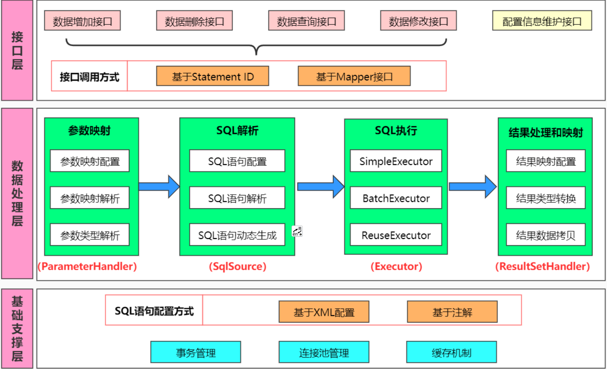
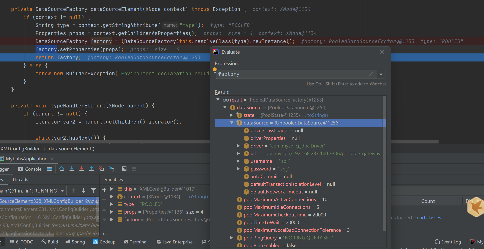
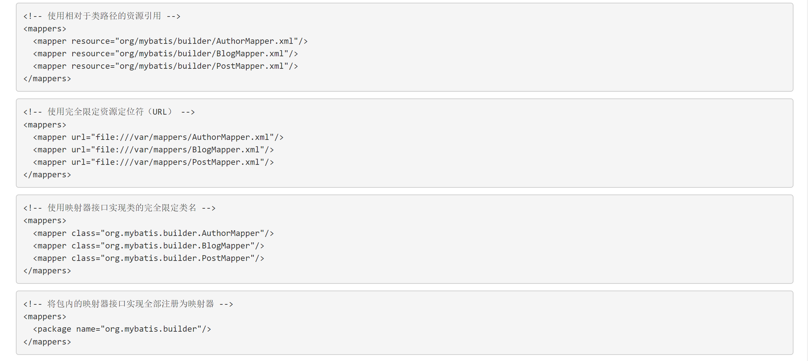
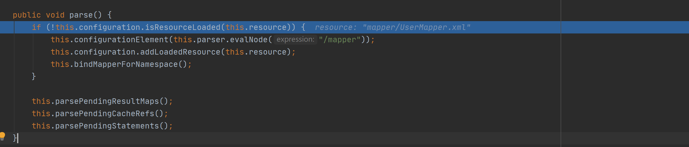
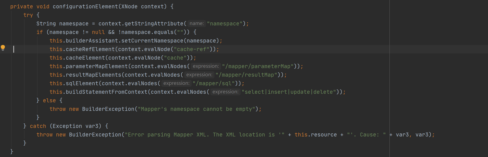

::: tip Mybatis

Mybatis源码分析
:::

[^源码git地址]: https://github.com/mybatis/mybatis-3

#### 简介

Mybatis是一款优秀的持久化框架，它支持自定义 SQL、存储过程以及高级映射。它是一款ORM（Object Relational Mapping）框架，用于实现面向对象的编程语言里，不同类型系统数据之间的准换。

#### Mybatis框架图



mybatis框架大致分为三层，基础支撑层，数据处理层，接口层。

基础支撑层：包含事务管理、连接池管理、缓存机制。

数据处理层：参数映射（ParameterHandler）、Sql解析（SqlSource）、Sql执行（Executor）、结果处理和映射（ResultSetHandler）。

接口层：提供给外部调用的。

#### 源码讲解

Mybatis初始化流程包括：**构建会话工厂—>解析配置—>解析mapper（元素、注解）—>解析SQL元素、缓存元素、参数映射、结果集映射—>构建Statement—>最后解析动态脚本并将statement添加到configuration中。**

启动类

```java
public class MybatisApplication {
    public static void main(String[] args) {
        try {
            // 构建会话工厂
            String resources = "mybatis-config.xml";
            InputStream inputStream = Resources.getResourceAsStream(resources);
            SqlSessionFactory build = new SqlSessionFactoryBuilder().build(inputStream);
            // 创建执行器
            SqlSession sqlSession = build.openSession();
            // 查询
            UserVO userVO = sqlSession.selectOne("com.wush.mapper.UserMapper.selectOne", "1");
            System.out.println(userVO);
        } catch (Exception e) {
            e.printStackTrace();
        }
    }
}
```

从new SqlSessionFactoryBuilder().build(inputStream) 处debugger进来，可以看到构建SqlSessionFactory的build方法，通过多态的方式，最终调用**build(InputStream inputStream, String environment, Properties properties)**。其中关键代码为parser.parse()，它使用了一个参照了XML文档的Reader实例或者InputStream去读取SqlMapConfig.xml文件。

```java
public class SqlSessionFactoryBuilder {
    public SqlSessionFactoryBuilder() {
    }

    public SqlSessionFactory build(Reader reader) {
        return this.build((Reader)reader, (String)null, (Properties)null);
    }

    public SqlSessionFactory build(Reader reader, String environment) {
        return this.build((Reader)reader, environment, (Properties)null);
    }

    public SqlSessionFactory build(Reader reader, Properties properties) {
        return this.build((Reader)reader, (String)null, properties);
    }
    
    // 以上三个方法均调用，配置文件以Reader对象传入
    public SqlSessionFactory build(Reader reader, String environment, Properties properties) {
        SqlSessionFactory var5;
        try {
            XMLConfigBuilder parser = new XMLConfigBuilder(reader, environment, properties);
            var5 = this.build(parser.parse());
        } catch (Exception var14) {
            throw ExceptionFactory.wrapException("Error building SqlSession.", var14);
        } finally {
            ErrorContext.instance().reset();

            try {
                reader.close();
            } catch (IOException var13) {
            }

        }

        return var5;
    }

    public SqlSessionFactory build(InputStream inputStream) {
        return this.build((InputStream)inputStream, (String)null, (Properties)null);
    }

    public SqlSessionFactory build(InputStream inputStream, String environment) {
        return this.build((InputStream)inputStream, environment, (Properties)null);
    }

    public SqlSessionFactory build(InputStream inputStream, Properties properties) {
        return this.build((InputStream)inputStream, (String)null, properties);
    }
    
    // 上面三个方法均最后调用此方法，配置文件以InputStream流的方式传入
    // 可选的参数是environment和properties。Environment决定加载哪种环境(开发环境/生产环境)，包括数据源和事务管理器。
    // 如果使用properties，那么就会加载那些properties（属性配置文件），那些属性可以用${propName}语法形式多次用在配置文件中。
    public SqlSessionFactory build(InputStream inputStream, String environment, Properties properties) {
        SqlSessionFactory var5;
        try {
            XMLConfigBuilder parser = new XMLConfigBuilder(inputStream, environment, properties);
            var5 = this.build(parser.parse());
        } catch (Exception var14) {
            throw ExceptionFactory.wrapException("Error building SqlSession.", var14);
        } finally {
            ErrorContext.instance().reset();

            try {
                inputStream.close();
            } catch (IOException var13) {
            }

        }

        return var5;
    }

    public SqlSessionFactory build(Configuration config) {
        return new DefaultSqlSessionFactory(config);
    }
}
```

解析配置，在parser.parse()方法种，parsed为标识位，默认为false，标识该配置文件只被解析一次。解析各标签的方法在parseConfiguration方法中。

```java
//mybatis按照dtd文件(http://mybatis.org/dtd/mybatis-3-config.dtd)规定的顺序解析各标签。
//其中environmentsElement方法用来解析environments标签，获取数据源，mapperElement方法是用来解析各mapper对应xml文件。
public Configuration parse() {
    // 如果被解析过了就直接报错，默认为false
    if (this.parsed) {
        throw new BuilderException("Each XMLConfigBuilder can only be used once.");
    } else {
        this.parsed = true;
        this.parseConfiguration(this.parser.evalNode("/configuration"));
        return this.configuration;
    }
}

// 解析各标签的配置
private void parseConfiguration(XNode root) {
    try {
        // 分步骤解析
        // 解析properties
        this.propertiesElement(root.evalNode("properties"));
        Properties settings = this.settingsAsProperties(root.evalNode("settings"));
        this.loadCustomVfs(settings);
        this.loadCustomLogImpl(settings);
        // 解析类型别名
        this.typeAliasesElement(root.evalNode("typeAliases"));
        // 插件
        this.pluginElement(root.evalNode("plugins"));
        // 对象工厂
        this.objectFactoryElement(root.evalNode("objectFactory"));
        // 对象包装工厂
        this.objectWrapperFactoryElement(root.evalNode("objectWrapperFactory"));
        this.reflectorFactoryElement(root.evalNode("reflectorFactory"));
        // 设置
        this.settingsElement(settings);
        // 环境，其中解析数据源配置的就在此处
        this.environmentsElement(root.evalNode("environments"));
        // databaseIdProvider
        this.databaseIdProviderElement(root.evalNode("databaseIdProvider"));
        // 类型处理器
        this.typeHandlerElement(root.evalNode("typeHandlers"));
        // 解析mappers
        this.mapperElement(root.evalNode("mappers"));
    } catch (Exception var3) {
        throw new BuilderException("Error parsing SQL Mapper Configuration. Cause: " + var3, var3);
    }
}
```

具体的每个解析就不看了， 首先来看mybatis是如何对环境进行解析，其中包含了数据源的配置。进入environmentsElement()方法中，

其中context为environments标签内容。

```java
private void environmentsElement(XNode context) throws Exception {
        if (context != null) {
            if (this.environment == null) {
                this.environment = context.getStringAttribute("default");
            }

            Iterator var2 = context.getChildren().iterator();

            while(var2.hasNext()) {
                XNode child = (XNode)var2.next();
                String id = child.getStringAttribute("id");
                if (this.isSpecifiedEnvironment(id)) {
                    TransactionFactory txFactory = this.transactionManagerElement(child.evalNode("transactionManager"));
                    // 在此获取数据源
                    DataSourceFactory dsFactory = this.dataSourceElement(child.evalNode("dataSource"));
                    DataSource dataSource = dsFactory.getDataSource();
                    Builder environmentBuilder = (new Builder(id)).transactionFactory(txFactory).dataSource(dataSource);
                    this.configuration.setEnvironment(environmentBuilder.build());
                }
            }
        }

}

// 解析dataSource
private DataSourceFactory dataSourceElement(XNode context) throws Exception {
        if (context != null) {
            String type = context.getStringAttribute("type");
            Properties props = context.getChildrenAsProperties();
            DataSourceFactory factory = (DataSourceFactory)this.resolveClass(type).newInstance();
            factory.setProperties(props);
            return factory;
        } else {
            throw new BuilderException("Environment declaration requires a DataSourceFactory.");
        }
}
```



至此mybatis已经获取到当前连接的数据源，接着我们来看mybatis是如何解析映射的xml文件的，此方法是用来解析各映射的xml文件的。在这我们可以看到mybatis查找映射文件有4种方式，分别为通过指定包扫描，使用相对于类路径的资源引用，使用完全限定资源定位符（URL），使用映射器接口实现类的全限定类名。其中优先级最高的为包扫描。



```java
private void mapperElement(XNode parent) throws Exception {
    if (parent != null) {
        Iterator var2 = parent.getChildren().iterator();

        while(true) {
            while(var2.hasNext()) {
                XNode child = (XNode)var2.next();
                String resource;
                if ("package".equals(child.getName())) {
                    resource = child.getStringAttribute("name");
                    this.configuration.addMappers(resource);
                } else {
                    resource = child.getStringAttribute("resource");
                    String url = child.getStringAttribute("url");
                    String mapperClass = child.getStringAttribute("class");
                    XMLMapperBuilder mapperParser;
                    InputStream inputStream;
                    if (resource != null && url == null && mapperClass == null) {
                        ErrorContext.instance().resource(resource);
                        inputStream = Resources.getResourceAsStream(resource);
                        mapperParser = new XMLMapperBuilder(inputStream, this.configuration, resource, this.configuration.getSqlFragments());
                        mapperParser.parse();
                    } else if (resource == null && url != null && mapperClass == null) {
                        ErrorContext.instance().resource(url);
                        inputStream = Resources.getUrlAsStream(url);
                        mapperParser = new XMLMapperBuilder(inputStream, this.configuration, url, this.configuration.getSqlFragments());
                        // 解析xml文件，设置sql和唯一key
                        mapperParser.parse();
                    } else {
                        if (resource != null || url != null || mapperClass == null) {
                            throw new BuilderException("A mapper element may only specify a url, resource or class, but not more than one.");
                        }

                        Class<?> mapperInterface = Resources.classForName(mapperClass);
                        this.configuration.addMapper(mapperInterface);
                    }
                }
            }

            return;
        }
    }
}
```

如果是resource引入的mapper.xml那么会走mapperParser.parse();接着会走configurationElement()方法





```java
private void configurationElement(XNode context) {
        try {
            String namespace = context.getStringAttribute("namespace");
            if (namespace != null && !namespace.equals("")) {
                this.builderAssistant.setCurrentNamespace(namespace);
                this.cacheRefElement(context.evalNode("cache-ref"));
                this.cacheElement(context.evalNode("cache"));
                this.parameterMapElement(context.evalNodes("/mapper/parameterMap"));
                this.resultMapElements(context.evalNodes("/mapper/resultMap"));
                this.sqlElement(context.evalNodes("/mapper/sql"));
                this.buildStatementFromContext(context.evalNodes("select|insert|update|delete"));
            } else {
                throw new BuilderException("Mapper's namespace cannot be empty");
            }
        } catch (Exception var3) {
            throw new BuilderException("Error parsing Mapper XML. The XML location is '" + this.resource + "'. Cause: " + var3, var3);
        }
}


private void buildStatementFromContext(List<XNode> list) {
        if (this.configuration.getDatabaseId() != null) {
            this.buildStatementFromContext(list, this.configuration.getDatabaseId());
        }

        this.buildStatementFromContext(list, (String)null);
}

// context为sql语句
private void buildStatementFromContext(List<XNode> list, String requiredDatabaseId) {
        Iterator var3 = list.iterator();

        while(var3.hasNext()) {
            XNode context = (XNode)var3.next();
            XMLStatementBuilder statementParser = new XMLStatementBuilder(this.configuration, this.builderAssistant, context, requiredDatabaseId);

            try {
                statementParser.parseStatementNode();
            } catch (IncompleteElementException var7) {
                this.configuration.addIncompleteStatement(statementParser);
            }
        }

}


public void parseStatementNode() {
    String id = this.context.getStringAttribute("id");
    String databaseId = this.context.getStringAttribute("databaseId");
    if (this.databaseIdMatchesCurrent(id, databaseId, this.requiredDatabaseId)) {
        String nodeName = this.context.getNode().getNodeName();
        SqlCommandType sqlCommandType = SqlCommandType.valueOf(nodeName.toUpperCase(Locale.ENGLISH));
        boolean isSelect = sqlCommandType == SqlCommandType.SELECT;
        boolean flushCache = this.context.getBooleanAttribute("flushCache", !isSelect);
        boolean useCache = this.context.getBooleanAttribute("useCache", isSelect);
        boolean resultOrdered = this.context.getBooleanAttribute("resultOrdered", false);
        XMLIncludeTransformer includeParser = new XMLIncludeTransformer(this.configuration, this.builderAssistant);
        includeParser.applyIncludes(this.context.getNode());
        String parameterType = this.context.getStringAttribute("parameterType");
        Class<?> parameterTypeClass = this.resolveClass(parameterType);
        String lang = this.context.getStringAttribute("lang");
        LanguageDriver langDriver = this.getLanguageDriver(lang);
        this.processSelectKeyNodes(id, parameterTypeClass, langDriver);
        String keyStatementId = id + "!selectKey";
        keyStatementId = this.builderAssistant.applyCurrentNamespace(keyStatementId, true);
        Object keyGenerator;
        if (this.configuration.hasKeyGenerator(keyStatementId)) {
            keyGenerator = this.configuration.getKeyGenerator(keyStatementId);
        } else {
            keyGenerator = this.context.getBooleanAttribute("useGeneratedKeys", this.configuration.isUseGeneratedKeys() && SqlCommandType.INSERT.equals(sqlCommandType)) ? Jdbc3KeyGenerator.INSTANCE : NoKeyGenerator.INSTANCE;
        }

        SqlSource sqlSource = langDriver.createSqlSource(this.configuration, this.context, parameterTypeClass);
        StatementType statementType = StatementType.valueOf(this.context.getStringAttribute("statementType", StatementType.PREPARED.toString()));
        Integer fetchSize = this.context.getIntAttribute("fetchSize");
        Integer timeout = this.context.getIntAttribute("timeout");
        String parameterMap = this.context.getStringAttribute("parameterMap");
        String resultType = this.context.getStringAttribute("resultType");
        Class<?> resultTypeClass = this.resolveClass(resultType);
        String resultMap = this.context.getStringAttribute("resultMap");
        String resultSetType = this.context.getStringAttribute("resultSetType");
        ResultSetType resultSetTypeEnum = this.resolveResultSetType(resultSetType);
        if (resultSetTypeEnum == null) {
            resultSetTypeEnum = this.configuration.getDefaultResultSetType();
        }

        String keyProperty = this.context.getStringAttribute("keyProperty");
        String keyColumn = this.context.getStringAttribute("keyColumn");
        String resultSets = this.context.getStringAttribute("resultSets");
        this.builderAssistant.addMappedStatement(id, sqlSource, statementType, sqlCommandType, fetchSize, timeout, parameterMap, parameterTypeClass, resultMap, resultTypeClass, resultSetTypeEnum, flushCache, useCache, resultOrdered, (KeyGenerator)keyGenerator, keyProperty, keyColumn, databaseId, langDriver, resultSets);
    }
}


public MappedStatement addMappedStatement(String id, SqlSource sqlSource, StatementType statementType, SqlCommandType sqlCommandType, Integer fetchSize, Integer timeout, String parameterMap, Class<?> parameterType, String resultMap, Class<?> resultType, ResultSetType resultSetType, boolean flushCache, boolean useCache, boolean resultOrdered, KeyGenerator keyGenerator, String keyProperty, String keyColumn, String databaseId, LanguageDriver lang, String resultSets) {
        if (this.unresolvedCacheRef) {
            throw new IncompleteElementException("Cache-ref not yet resolved");
        } else {
            id = this.applyCurrentNamespace(id, false);
            boolean isSelect = sqlCommandType == SqlCommandType.SELECT;
            org.apache.ibatis.mapping.MappedStatement.Builder statementBuilder = (new org.apache.ibatis.mapping.MappedStatement.Builder(this.configuration, id, sqlSource, sqlCommandType)).resource(this.resource).fetchSize(fetchSize).timeout(timeout).statementType(statementType).keyGenerator(keyGenerator).keyProperty(keyProperty).keyColumn(keyColumn).databaseId(databaseId).lang(lang).resultOrdered(resultOrdered).resultSets(resultSets).resultMaps(this.getStatementResultMaps(resultMap, resultType, id)).resultSetType(resultSetType).flushCacheRequired((Boolean)this.valueOrDefault(flushCache, !isSelect)).useCache((Boolean)this.valueOrDefault(useCache, isSelect)).cache(this.currentCache);
            ParameterMap statementParameterMap = this.getStatementParameterMap(parameterMap, parameterType, id);
            if (statementParameterMap != null) {
                statementBuilder.parameterMap(statementParameterMap);
            }

            MappedStatement statement = statementBuilder.build();
            this.configuration.addMappedStatement(statement);
            return statement;
        }
}

```

创建SqlSession，在此创建执行器

```java
SqlSession sqlSession = build.openSession();
```

```java
public SqlSession openSession() {
    return this.openSessionFromDataSource(this.configuration.getDefaultExecutorType(), (TransactionIsolationLevel)null, false);
}
```

```java
private SqlSession openSessionFromDataSource(ExecutorType execType, TransactionIsolationLevel level, boolean autoCommit) {
    Transaction tx = null;

    DefaultSqlSession var8;
    try {
        Environment environment = this.configuration.getEnvironment();
        TransactionFactory transactionFactory = this.getTransactionFactoryFromEnvironment(environment);
        tx = transactionFactory.newTransaction(environment.getDataSource(), level, autoCommit);
        Executor executor = this.configuration.newExecutor(tx, execType);
        var8 = new DefaultSqlSession(this.configuration, executor, autoCommit);
    } catch (Exception var12) {
        this.closeTransaction(tx);
        throw ExceptionFactory.wrapException("Error opening session.  Cause: " + var12, var12);
    } finally {
        ErrorContext.instance().reset();
    }

    return var8;
}

// 执行器有3种，批量、复用、简单
public Executor newExecutor(Transaction transaction, ExecutorType executorType) {
    executorType = executorType == null ? this.defaultExecutorType : executorType;
    executorType = executorType == null ? ExecutorType.SIMPLE : executorType;
    Object executor;
    if (ExecutorType.BATCH == executorType) {
        executor = new BatchExecutor(this, transaction);
    } else if (ExecutorType.REUSE == executorType) {
        executor = new ReuseExecutor(this, transaction);
    } else {
        executor = new SimpleExecutor(this, transaction);
    }
    
    // 一级缓存，默认开启
    if (this.cacheEnabled) {
        executor = new CachingExecutor((Executor)executor);
    }

    Executor executor = (Executor)this.interceptorChain.pluginAll(executor);
    return executor;
}
```

