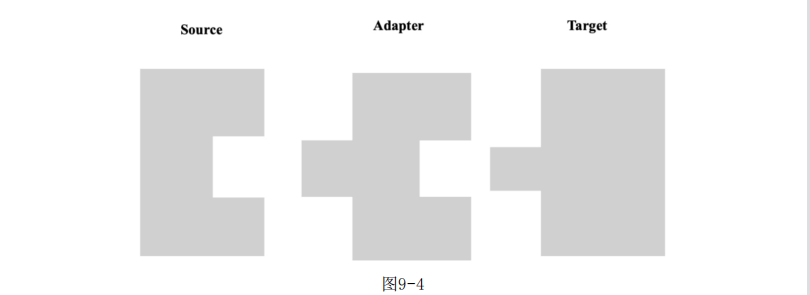
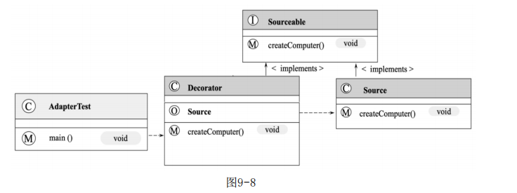
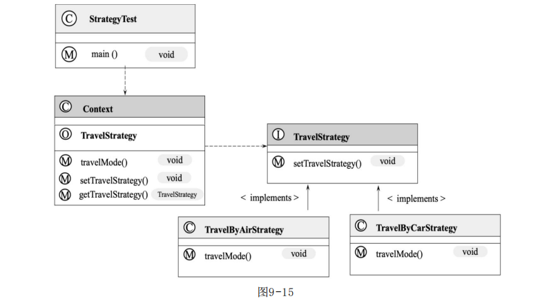
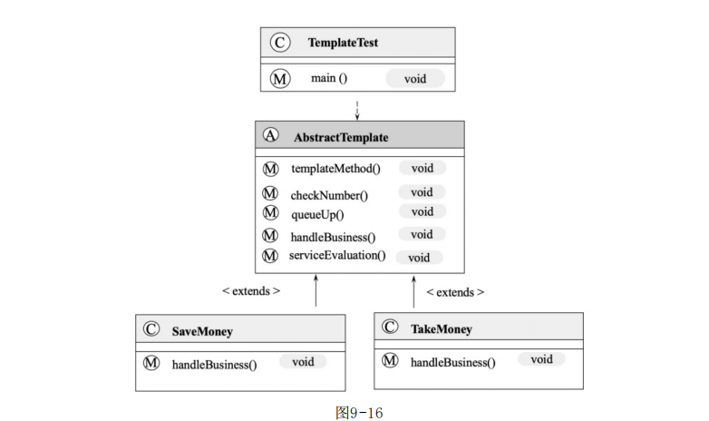

::: tip
设计模式
:::

## 设计模式

### 2. 工厂模式的概念及Java实现

​		工厂模式（Factory Pattern）是最常见的设计模式，该模式属于创建型模式，它提供了一种简单、快捷、高效而安全地创建对象的方式。工厂模式在接口中定义了创建对象的方法，而具体创建对象的过程在子类中实现，用户只需通过接口创建需要的对象即可，不用关注对象的具体创建过程。同时，不同的子类可根据需求灵活实现创建对象的不同方法。

​		通俗的讲，工厂模式的本质就是工厂方法代替new操作创建一种实例化对象的方式，以提供一种方便的创建同种类型接口的产品的复杂对象。

​		如何代码通过new关键字实例化类Class的一个实例class，但如果Class类在实例化时需要一些初始化参数，而这些参数需要其他类的信息，则直接通过new关键字实例化对象会增加代码的耦合度，不利于维护，因此需要通过工厂模式将创建实例和使用实例分开。将创建实例化对象的过程封装到工厂方法中。

### 3. 抽象工厂模式的概念及Java实现

​		抽象工厂模式（Abstract Factory Pattern）在工厂模式上添加了一个创建不同工厂的抽象接口（抽象类或接口实现），该接口可叫作超级工厂。在使用过程中，我们首先通过抽象接口创建出不同的工厂对象，然后根据不同的工厂对象创建不同的对象。

###   4. 单例模式的概念及 Java 实现

​		单例模式是保证系统实例唯一性的重要手段。单例模式首先通过将类的实例化方法私有化来防止程序通过其他方式创建该类的实例，然后通过一个全局唯一获取该类实例的方法帮助用户获取类的实例，用户只需也只能通过调用该方法获取类的实例。

​		单例模式的设计保证了一个类在整个操作系统中同一时刻只有一个实例存在，主要被用与一个全局类的对象在多个地方被使用并且对象的状态是全局变化的场景下。同时，单例模式为系统的优化提供了很好的思路，频繁的创建和销毁对象都会增加系统的资源消耗，而单例模式保障了整个系统只有一个对象能被使用，很好地节约了资源。

​		单例模式常见写法有懒汉式（线程安全）、饿汉式、静态内部类、双重校验锁。

#### 4.1 懒汉模式（线程安全）

​		懒汉模式很简单：定义一个私有的静态对象instance，之所以定义instance为静态，是因为静态属性或方法是属于类的，能够很好地保障单例对象的唯一性；然后定义一个加锁的静态方法获取该对象，如果对象为null，则定义一个对象实例并将其赋值给instance，这样下次再获取该对象时便能直接获取了。

​		懒汉模式在获取对象实例时做了加锁操作，因此是线程安全的。代码如下：

```java
public class LazySingLeton {

    /**
     * 对象私有化
     */
    private LazySingLeton(){
    }

    private static LazySingLeton lazySingLeton;

    public static synchronized LazySingLeton getInstance(){
        if (lazySingLeton == null){
            lazySingLeton = new LazySingLeton();
        }
        return lazySingLeton;
    }

}
```

#### 4.2 饿汉模式

​		饿汉模式指的是在类中直接定义全局的静态对象的实例并初始化，然后提供一个方法获取该实例的对象。懒汉模式和饿汉模式的最大不同在于，懒汉模式在类中定义了单例但是并未初始化，实例化过程是在获取单例对象的方法实现的，也就是说，在第一次调用懒汉模式时，该对象一定为空，然后对实例化对象并赋值，这样下次就能直接获取对象了；而饿汉模式是在定义单例对象的同时将其初始化，直接使用即可。也就是说，在饿汉模式下，在Class Loader完成后该类的实例便已经存在JVM中，代码如下：

```java
public class HungrySingleton {

    private static HungrySingleton hungrySingleton = new HungrySingleton();


    private HungrySingleton(){

    }

    public static HungrySingleton getInstance(){
        return hungrySingleton;
    }

}

```

#### 4.3 静态内部类

​		静态内部类通过在类中定义静态内部类，将对象单例的定义和初始化都放在内部类中完成，我们在获取对象时要通过静态内部类调用其单例对象。之所以主要设计，是因为类的静态内部类在JVM中是唯一的，这很好的保证了单例对象的唯一性，代码如下：

```java
public class Singleton {


    private static class SingtonHolder{
        private static final Singleton INSTANCE = new Singleton();
    }

    private Singleton(){
    }

    public static final Singleton getInstance(){
        return SingtonHolder.INSTANCE;
    }

}
```

#### 4.4 双重校验锁

​		双锁模式指在懒汉式模式的基础上做进一步优化，给静态对象的定义加上volatile锁来保障初始化时对象的唯一性，在获取对象时通过synchronized(Singleton.class)给单例类加锁来保障操作的唯一性，代码如下：

```java
public class LockSingleton {

    private volatile static LockSingleton lockSingleton; // 对象锁


    private LockSingleton(){

    }

    public LockSingleton getLockSingleton(){
        if (lockSingleton == null){
            synchronized (LockSingleton.class){ // synchronized方法锁
                if (lockSingleton == null){
                    lockSingleton = new LockSingleton();
                }
            }
        }
        return lockSingleton;
    }
}
```

###   5. 建造者模式的概念及 Java 实现

​		建造者模式（Builder Pattern）使用多个简单的对象创建一个复杂的对象，用于将一个复杂的构建与其表示分离，使得同样的构建过程可以创建不同的表示，然后通过一个Builder类（该Builder类是独立与其他对象的）创建最终的对象。

​		建造者模式主要用于解决软件系统中复杂对象的创建问题，比如有些复杂对象的创建需要通过各部分的子对象用一定的算法构成，在需求变化时这些复杂对象将面临很大的改变，这十分不利于系统的稳定运行。但是，使用建造者模式能将它们各部分的算法包装起来，在需求变化后只需调整各个算法的组合方式和顺序，能极大提高系统的稳定性。建造者模式常被用于一些基本部件不会变而其组合经常变化的应用场景下。

​		注意，建造者模式和工厂模式最大的区别是，建造者模式本身更关注产品的组合方式和装配顺序，而工厂模式关注产品的生产本身。

​		建造者模式在设计时主要有以下几个角色：

- Builder：创建一个复杂产品对象的抽象接口。

- ConcreteBuilder：Builder接口的实现类，用于定义复杂产品各个部件的装配流程。

- Director：构造一个使用Builder接口的对象。

- Product：表示被构造的复杂对象。ConcreteBuilder定义了改复杂对象的装配流程，而Product定义了该复杂对象的结构和内部标识。

  以生产一个电脑为例，电脑的生产包括CPU、Memory、Disk等生产过程，这些生产过程对顺序不敏感，这里的Product角色就是电脑。我们还需

要定义生产电脑的Builder、ConcreteBuilder和Director。

​		具体实现如下。

​	（1）定义需要生产的产品Computer：

```java
public class Computer {

    private String cpu;

    private String memory;

    private String disk;


    public String getCpu() {
        return cpu;
    }

    public void setCpu(String cpu) {
        this.cpu = cpu;
    }

    public String getMemory() {
        return memory;
    }

    public void setMemory(String memory) {
        this.memory = memory;
    }

    public String getDisk() {
        return disk;
    }

    public void setDisk(String disk) {
        this.disk = disk;
    }
}
```

​	（2）定义抽象接口BaseBuilder来描述产品构造和装配的过程:

```java
public abstract class BaseBuilder {

    public abstract void buildCpu();

    public abstract void buildMemory();

    public abstract void buildDisk();

    public abstract Computer buildComputer();

}
```

​	（3）定义ComputerBuilder接口实现类BaseBuilder以实现构造和装配该产品的各个组件：

```java
public class ComputerBuild  extends BaseBuilder{

    public Computer computer = new Computer();

    @Override
    public void buildCpu() {
        this.computer.setCpu("i7-12100");
        System.out.println("构造cpu："+this.computer.getCpu());

    }

    @Override
    public void buildMemory() {
        computer.setMemory("16G");
        System.out.println("构造内存："+computer.getMemory());

    }

    @Override
    public void buildDisk() {
        computer.setDisk("1T");
        System.out.println("构造硬盘："+computer.getDisk());
    }

    @Override
    public Computer buildComputer() {
        return computer;
    }
}
```

​	（4）定义ComputerDirector使用Builder接口实现产品的装配：

```java
public class ComputerDirector {

    public Computer buildComputerDirector(){
        ComputerBuild computerBuild = new ComputerBuild();
        computerBuild.buildCpu();
        computerBuild.buildDisk();
        computerBuild.buildMemory();
        Computer computer = computerBuild.buildComputer();
        return computer;
    }

}
```

​	（5）构建Computer：

```java
public class BuilderMain {

    public static void main(String[] args) {
        ComputerDirector computerDirector = new ComputerDirector();
        Computer computer = computerDirector.buildComputerDirector();
        System.out.println(computer);
    }

}
```

###  7. 适配器模式的概念及Java实现

​		我们常常在开发中遇到各个系统之间的对接问题，然而每个系统的数据模型或多或少均存在差别，因此可能存在修改现有对象模型的情况，这将影响到系统的稳定。若想在不修改原有代码结构（类的结构）的情况下完成友好对接，就需要用到适配器模式。

​		适配器模式（Adapter Pattern）通过定义一个适配器类作为两个不兼容的接口之间的桥梁，将一个类的接口转换成用户期望的另一个接口，使得两个或多个原本不兼容的接口可以基于适配器类一起工作。

​		适配器模式主要通过适配器类实现各个接口之间的兼容，该类通过依赖注入或者继承实现各个接口功能并对外统一提供服务，可形象的使用下图来表示适配器模式。



​		在适配器模式的实现有三种角色：Source、Targetable、Adapter。Source是待适配器的类，Targetable是目标接口，Adapter是适配器。我们在具体的应用中通过Adapter将Source的功能扩展到Targetable，以实现接口的兼容。适配器的实现主要分为三类：类适配器模式、对象适配器模式、接口适配器模式。

#### 7.1 类适配器模式

​		在需要不改变原有接口或类的结构的情况下扩展类的功能以适配不同接口时，可以使用类的适配器模式。适配器模式通过创建一个继承原有类（需要扩展的类）并实现新接口的适配器类来实现。

具体实现如下。

​	（1）定义Source类：

```java
public class Source {

    public void editTextFile(){
        System.out.println("text is edit");
    }

}
```

​		以上代码定义了待适配的Source类，在该类中实现了一个编辑文本文件的方法editTextFile()。	

​	（2）定义Targetable接口：

```java
public interface Targetable {

    void editTextFile();

    void editWordFile();

}
```

​		以上代码定义了一个Targetable接口，在该接口中定义了两个方法，editTextFile和editWordFile，其中editTextFile是Source中待适配的方法。	

​	（3）定义ClassAdapter继承Source类并实现Targetable接口：

```java
public class ClassAdapter extends Source implements Targetable{
    @Override
    public void editWordFile() {
        System.out.println(" word is edit");
    }

}
```

​		以上代码定义了一个Adapter类并继承了Source类实现Targetable接口，以完成对Source类的适配。适配后的类既可以编辑文本文件，也可以编辑Word文件。

​	（4）使用类的适配器：

```java
public class MainClassAdapter {

    // 使用适配器
    public static void main(String[] args) {
        ClassAdapter classAdapter = new ClassAdapter();
        classAdapter.editTextFile();
    }

}
```

#### 7.2 对象适配器模式

​		对象适配器模式的思路和类适配器的模式基本相同，只是修改了Adapter类。Adapter不在继承Source类，而是持有Source类的实例，以解决兼容性问题。具体的UML设计如何所示。

#### 7.3 接口适配器模式

###  8. 装饰者模式的概念及Java实现

​		装饰者模式（Decorator Pattern）指在无需改变原有类及类的继承关系的情况下，动态扩展一个类的功能。它通过装饰者来包裹真实的对象，并动态地向对象添加或者撤销功能。

​		装饰者包括Source和Decorator两种角色，Source是被装饰者，Decorator是装饰者。装饰者模式通过装饰者可以为被装饰者Source动态添加一些功能。具体的UML设置如图所示。



具体实现如下。

​		（1）定义Sourceable接口：

```java
public interface Sourceable {

    void createComputer();

}
```

​		以上代码定义了一个Sourceable接口，该接口定义了一个生产电脑的方法createComputer().

​		（2）定义Sourceable接口的实现类Source：

```java
public class SourceableImpl implements Sourceable{
    @Override
    public void createComputer() {
        System.out.printf("create computer!!!");
    }
}
```

​		以 上 代 码 定 义 了 Sourceable 接 口 的 实 现 类 Source 并 实 现 了 其createComputer()。

​		（3）定义装饰者类Decorator：

```java
public class Decorator implements Sourceable{

    private Sourceable sourceable;

    public Decorator(Sourceable sourceable){
        this.sourceable = sourceable;
    }

    @Override
    public void createComputer() {
        sourceable.createComputer();
        System.out.printf("decorator is create computer");
    }
}
```

​		以上代码定义了装饰者类Decorator，装饰者类通过构造函数将Sourceable实例初始化到内部，并在其方法createComputer()中调用原方法后加上了装饰者逻辑，这里的装饰指在电脑创建完成后给电脑装上相应的系统。注意，之前的Sourceable没有给电脑安装系统的步骤，我们引入装饰者为Sourceable扩展了安装系统的功能。

​		（4）使用装饰者模式：

```java
public class DecoratorMain {

    public static void main(String[] args) {
        Decorator decorator = new Decorator(new SourceableImpl());
        decorator.createComputer();
    }

}

```

​		在使用装饰者模式时，需要先定义一个待装饰的Source类的source对象，然后初始化构造器Decorator并在构造函数中传入source对象，最后调用createComputer()，程序在创建完电脑后还为电脑安装了系统。运行结果如下：

```java
create computer!!!decorator is create computer
```

###  9. 代理模式的概念及Java实现


###  14. 策略模式的概念及Java实现

​		策略模式为同一行为定义了不同的策略，并为每种策略都实现了不同的方法。在用户使用的时候，系统根据不同的策略自动切换不同的方法来实现策略的改变。同一策略下的不同方法是对同一功能的不同实现，因此在使用时可以相互替换而不影响用户的使用。

​		策略模式的实现是在接口中定义不同的策略，在实现类中完成了对不同策略下具体行为的实现，并将用户的策略状态存储在上下文（Context）中来完成策略的存储和状态的改变。

​		我们在现实生活中常常碰到实现目标有多种可选策略的情况，比如下班后可以通过开车、坐公交、坐地铁、骑自行回家，在旅行时可以选择火车、飞机、汽车等交通工具，在淘宝上购买指定商品时可以选择直接减免部分钱、送赠品、送积分等方式。

​		对于上述情况，使用多重if ...else条件转移语句也可实现，但属于硬编码方式，这样做不但会使代码复杂、难懂，而且在增加、删除、更换 算法时都需要修改源代码，不易维护，违背了开闭原则。通过策略模式就能优雅地解决这些问题。

​		下面以旅游交通工具的选择为例实现策略模式，具体的UML设计如图9-15所示。



​		具体实现如下。

​		（1）定义TravelStrategy：

```java
public interface TravelStrategy {

    void travelMode();

}
```

​		以上代码定义了策略模式接口TravelStrategy，并在该接口中定义了方法travelMode()来表示出行方式。

​		（2）定义TravelStrategy的两种实现方式TravelByAirStrategy和TravelByCarStrategy：

```java
public class TravelByCarStrategy implements TravelStrategy{

    @Override
    public void travelMode() {
        System.out.println("travel by car");
    }
}


public class TravelByAirStrategy implements TravelStrategy{
    @Override
    public void travelMode() {
        System.out.println("travel by air");
    }
}
```

​		以上代码定义了TravelStrategy的两个实现类TravelByAirStrategy和TravelByCarStrategy，分别表示基于飞机的出行方式和基于开车自驾的出行方式，并实现了方法travelMode()。

​		（3）定义Context实现策略模式：

```java
public class Context {

    private TravelStrategy travelStrategy;

    public TravelStrategy getTravelStrategy() {
        return travelStrategy;
    }

    public void setTravelStrategy(TravelStrategy travelStrategy) {
        this.travelStrategy = travelStrategy;
    }

    public void travelMode(){
        this.travelStrategy.travelMode();
    }

}
```

​		以上代码定义了策略模式实现的核心类Context，在该类中持有TravelStrategy实例并通过setTravelStrategy()实现了不同策略的切换。

​		（4）使用策略模式：

```java
public class StrategyMain {

    public static void main(String[] args) {
        Context context = new Context();
        context.setTravelStrategy(new TravelByAirStrategy());
        context.travelMode();

        context.setTravelStrategy(new TravelByCarStrategy());
        context.travelMode();

    }

}
```

​		在使用策略模式时，首先需要定义一个Context，然后定义不同的策略实现并将其注入Context中实现不同策略的切换。具体的执行结果如下：

```java
travel by air
travel by car
```

###  15. 模板方法模式的概念及Java实现

​		模板方法模式定义了一个算法框架，并通过继承的方式将算法的实现延迟到子类中，使得子类可以在不改变算法框架及其流程的前提下重新定义该算法在某些特定的环节的实现，是一种行为型模式。

​		改模式在抽象类中定义了算法的结构并实现了公共部分算法，在子类中实现可变的部分并根据不同的业务需求实现不同的扩展。模板方法模式的优点在于其在父类中定义了算法的框架以保证算法的稳定性，同时在父类中实现了算法公共部分的方法来保障代码的复用；将部分算法延迟到子类中实现，因此子类可以通过继承的方式来扩展或重新定义算法的功能而不影响算法的稳定性，符合开闭原则。

​		模板方法模式需要注意抽象类与具体子类之间的协作，在具体使用时包含以下主要角色。

​		◎ 抽象类（Abstract Class）：定义了算法的框架，由基本方法和模板方法组成。基本方法定义了算法有哪些环节，模板方法定义了算法各个环节执行的流程。

​		◎ 具体子类（Concrete Class）：对在抽象类中定义的算法根据需求进行不同的实现。

​		下面以银行办理业务为例实现一个模板方法模式，我们去银行办理业 务都要经过抽号、排队、办理业务和评价，其中的业务流程是固定的，但 办理的具体业务比较多，比如取钱、存钱、开卡等。其中，办理业务的固 定流程就是模板算法中的框架，它常常是不变的，由抽象类定义和实现， 而具体办理的业务是可变的部分，通常交给子类去做具体的实现。具体的UML设计如图9-16所示。



具体实现如下。

（1）定义AbstractTemplate模板类：

```java
public abstract class AbstractTemplate {

    public void templateMethod(){
        checkNumber();
        queueUp();
        handleBusiness();
        serviceEvaluation();
    }

    /**
     * 取号
     */
    public void checkNumber(){
        System.out.println("checkNumber !!!!!!");
    }

    /**
     * 排队
     */
    public void queueUp(){
        System.out.println("queueUp !!!!!!");
    }

    /**
     * 业务办理
     */
    public abstract void handleBusiness();

    /**
     * 服务评价
     */
    public void serviceEvaluation(){
        System.out.println("serviceEvaluation !!!!!!");
    }


}
```

​		以上代码定义了抽象类AbstractTemplate，用于实现模板方法模式， 其中定义了checkNumber()表示抽号过程，queueUp()表示排队过程，handleBusiness()表示需要办理的具体业务，serviceEvaluation()表示在业务办理完成后对服务的评价，templateMethod()定义了银行办理业务的核心流程，即取号、排队、办理业务和评价。抽象类实现了取号、排队、 办理业务这些公共方法，而将办理业务的具体方法交给具体的业务类实现。

​		（2）定义SaveMoney的业务实现：

```java
public class SaveMoney extends AbstractTemplate{
    @Override
    public void handleBusiness() {
        System.out.println("SaveMoney ！！！！！！！！");
    }
}
```

​		以上代码定义了SaveMoney并实现了handleBusiness()，以完成存钱的业务逻辑。

​		（3）定义TakeMoney的业务实现：

```
public class TaskeMoney extends AbstractTemplate{
    @Override
    public void handleBusiness() {
        System.out.println("takemoney !!!!!!");
    }
}

```

​		以上代码定义了TakeMoney并实现了handleBusiness()，以完成取钱的业务逻辑。

​		（4）使用模板模式：

```java
public class TemplateMethodMain {

    public static void main(String[] args) {
        SaveMoney saveMoney = new SaveMoney();
        saveMoney.templateMethod();
        System.out.println("----------------------------");
        TaskeMoney taskeMoney = new TaskeMoney();
        taskeMoney.templateMethod();
    }

}
```

​		在使用模板模式时只需按照需求定义具体的模板类实例并调用其模板方法即可，具体的执行结果如下：

```java
checkNumber !!!!!!
queueUp !!!!!!
SaveMoney ！！！！！！！！
serviceEvaluation !!!!!!
----------------------------
checkNumber !!!!!!
queueUp !!!!!!
takemoney !!!!!!
serviceEvaluation !!!!!!
```

###  16. 观察者模式的概念及Java实现

​		观察者（Observer）模式指在被观察者的状态发生改变时，系统基于事件驱动理论将其状态通知到订阅其状态的观察者对象中，以完成状态的修改和事件的传播。这种模式有时又叫作发布-订阅模式或者模型-视图模式。

​		观察者是一种对象行为型模式，观察者和被观察者之间的关系属于抽象耦合的关系，主要优点是在观察者与被观察者之间建立了一套事件触发机制，以降低二者之间的耦合度。

​		观察者的主要角色如下：

- 抽象主题（Subject）：持有订阅了该主题的观察者对象的集合，同时提供了增加、删除观察者对象的方法和主题状态发生变化后通知方法。

- 具体主题（Concrete Subject）：实现了抽象主题的通知方法，在主题内部状态发生变化时，调用该方法通知订阅了主题状态的观察者对象。

- 抽象观察者（Observer）：观察者的抽象类或接口，定义了主题状态发生变化时需要调用的方法。

- 具体观察者（Concrete Subject）：抽象观察者的实现类，在收到主题状态变化的信息后执行具体的触发机制。

  观察者模式具体的 UML 设计

  具体实现

  （1）定义抽象主题Subject

  ```
  public abstract class AbstractSubject {
  
      protected List<Observer> observers = new ArrayList<Observer>();
  
  
      /**
       * 添加观察值方法
       * @param observer
       */
      public void add(Observer observer){
          observers.add(observer);
      }
  
      /**
       * 删除观察者方法
       * @param observer
       */
      public void remove(Observer observer){
          observers.remove(observer);
      }
  
      /**
       * 通知观察者的抽象方法
       */
      public abstract void notifyObserver();
  
  }
  ```

  （2）定义具体的主题Concrete Subject

  ```
  public class Subject extends AbstractSubject {
  
      @Override
      public void notifyObserver() {
          for (Observer observer : this.observers) {
              observer.response();
          }
      }
  }
  ```

  （3）定义抽象观察者Observer

  ```
  public interface Observer {
      void response();
  }
  ```

  （4）定义具体的观察者Concrete Observer

  ```
  public class ConcreteObserver implements Observer{
  
      public void response() {
          System.out.println("具体观察者作出反应");
      }
  }
  ```

  （5）使用观察者模式

  ```
  public class TestObserve {
  
      public static void main(String[] args) {
          ConcreteObserver concreteObserver = new ConcreteObserver();
          Subject subject = new Subject();
          subject.add(concreteObserver);
          subject.notifyObserver();
      }
  }
  ```

### 17. 迭代器模式的概念及 Java 实现


###  18. 责任链模式的概念及Java实现

​		责任链（Chain of Responsibility）模式也叫作职责链模式，用于避免请求发送者与多个请求处理者耦合在一起，让所有请求的处理者持有下一个对象的引用，从而将请求串联成一条链，在有请求发生时，可将请求沿着这条链传递，直到遇到该对象的处理器。

​		在责任链模式下，用户只需将请求发送到责任链上即可，无须关心请求的处理细节和传递过程，所有责任链模式优雅地将请求的发送和处理进行了解耦。

​		责任链模式在Web请求中很常见，比如我们要为客户端

###  19. 命令模式的概念及Java实现
